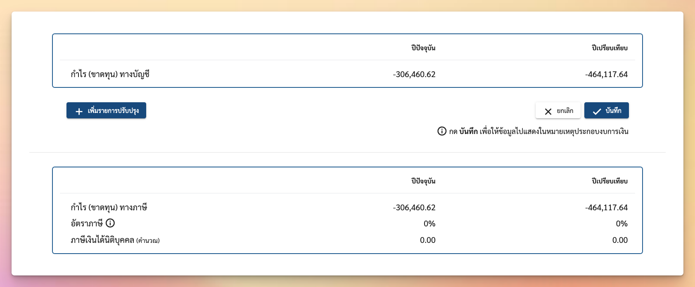

# Corporate Income Tax

ส่วนนี้ไม่เกี่ยวกับการสร้างเล่มรายงานโดยตรง แต่เป็นเครื่องมือที่ช่วยสร้างข้อมูลประกอบอย่าง `unrecordableExpense` ใน `TrialBalance.additionalInfo` และยังช่วยคำนวณหา **"ภาษีเงินได้นิติบุคคล"** หากงบเหล่านั้นยังไม่มีการบันทึกภาษีลงมาในงบทดลอง



ซึ่งการคำนวณ **ภาษีเงินได้่นิติบุคคล** จะคิดจาก 

$$Corporate Income Tax = Income + UnrecordableExpense - Expenses$$

หรือก็คือ กำไรขั้นต้นหักด้วย `UnrecordableExpense`

### How to use

```ts
const calculator = new CorporateIncomeTaxCalculator(trialBalance, unrecordableExpenses)
const cit = calculator.calculateProfitAndTaxRate() // ยอดของภาษีเงินได้นิติบุคคล
const percentage = calculator.calculateProfitAndTaxRatePercentage() // อัตราภาษีเงินได้นิติบุคคล
```

หรืออ่านตัวอย่างเพิ่มเติมได้ที่ `calculator.corporate-income-tax.test.ts` ใน project
