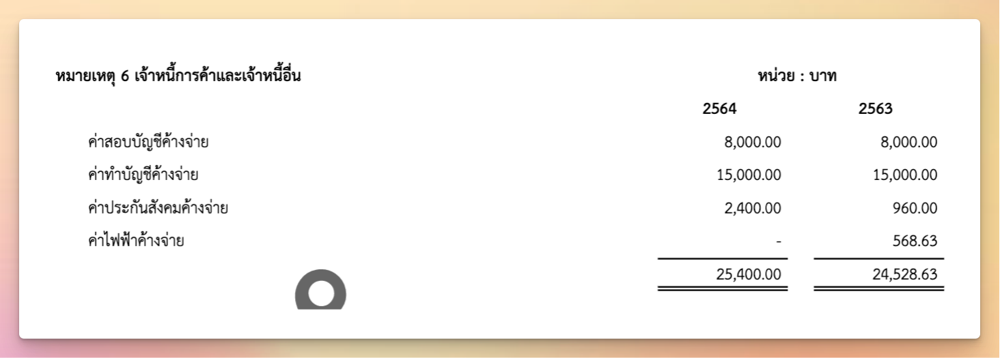

# Remark Row Generator

เนื่องจาก **"หมายเหตุประกอบงบการเงิน"** มีรูปแบบการแสดงผลในแต่ละบรรทัด ที่ค่อนข้างหลากหลายและมีการใช้ซ้ำหลายๆที่ ทางทีมจึงตัดสินใจสร้าง function ย่อยๆของแต่ละ row เพื่อให้สะดวกในการเอาไปประกอบเป็น template ใหม่ของหมายเหตุประกอบงบการเงินนั้นๆ ไว้ใน `src/config/remark-row-generator.ts`

โดยการออกแบบ function เหล่านี้ทางเราต้องการให้มันทำงานร่วมกันได้แบบเป็น pipeline จึงได้กำหนด type ที่เกี่ยวข้องไว้ดังนี้

```ts
export type RemarkCell = {
	text?: string
	colSpan?: number
	style?: string[]
	leadingIndent?: number
	alignment?: string
	margin?: number[]
	stack?: RemarkCell[]
	canvas?: CanvasElement[]
}
```

**RemarkCell** ใช้เป็น type ของแต่ละ cell ในแต่ละ row โดยออกแบบให้ล้อไปกับ object ของ table cell ใน [pdfmake](https://pdfmake.github.io/docs/0.1/document-definition-object/tables/) ที่เราใช้ในการสร้าง pdf

```ts
export type RemarkRow = RemarkCell[]
```

**RemarkRow** ใช้เป็น type ที่แทน 1 บรรทัด ซึ่ง 1 บรรทัด จะประกอบด้วย cell หลายๆ cell

```ts
export type TemplateResource = {
	tb: TrialBalance
	rows: RemarkRow[]
	widths: number[]
}
```

**TemplateResource** ใช้เป็น type ของข้อมูลที่จะใช้ในการสร้าง template ซึ่งจะประกอบด้วย 
- tb: ข้อมูล trial balance เป็นแหล่งข้อมูลสำหรับหมายเหตุตัวนั้น
- rows: คือ ข้อมูลของแต่ละบรรทัดที่พร้อมส่งไปให้ pdfmake ทำการ render ให้เป็น pdf
- widths: คือ ความกว้างของแต่ละ column ในหมายเหตุนั้นๆ (ส่วนมากจะใช้เลขชุดเดียวกัน)

## ฟังก์ชันที่ควรรู้

```ts
export const remarkPipe = (...fns: RemarkTemplateFn[]): RemarkTemplateFn => {
	return (resource: TemplateResource) => fns.reduce((accResource, f) => f(accResource), resource)
}
```

ฟังก์ชัน `remarkPipe` เป็นตัวสร้าง pipeline เพื่อให้ผู้ใช้งาน(developer) สามารถเอา function เล็กๆ มาต่อกันเพื่อเอาไปสร้าง template ของหมายเหตุตัวนั้นๆได้ ดังเช่นตัวอย่าง

```ts
export const generateSimpleByRecordConfig = (
	id: number,
	remarkTitle: string,
	options: Partial<NewAccountType>,
): RemarkConfigOther => {
	return {
		id,
		title: remarkTitle,
		fn: remarkPipe(
			titleOther(remarkTitle, { id }),
			tableHeader,
			recByCat(options),
			sumByCat(options),
			note({ id }),
		),
	}
}
```

ให้สังเกต property `fn` ใน return ของ `generateSimpleByRecordConfig` จะเห็นว่ามีการใช้ `remarkPipe` มาทำการประกอบบรรทัดจากบนลงล่าง ด้วยฟังก์ชันย่อยๆ ซึ่งจะได้ผลลัพธ์ดังภาพ



1. หัวข้อตัวหนา และ หน่วย:บาท ถูกสร้างขึ้นมาจากฟังก์ชัน `titleOther`
2. หัวตารางของปี ถูกสร้างขึ้นมาจากฟังก์ชัน `tableHeader`
3. รายละเอียดงบหลายๆบรรทัด ถูกสร้างขึ้นมาจากฟังก์ชัน `recByCat`
4. บรรทัดผลรวมที่มีการขีดเส้นใต้ ถูกสร้างขึ้นมาจากฟังก์ชัน `sumByCat`
5. note เนื่องจากภาพตัวอย่างผู้ใช้ไม่ได้ใส่ input เพิ่มเติมจึงไม่มีการ render

### การไล่ code เพื่อทำการสร้างหรือแก้ไขหมายเหตุ

ให้ดูที่ `src/config/remark-other-template.ts` และ `src/config/remark-row-generator.ts` โดย

#### ต้องการแก้แค่เพียงส่วนที่เป็น Row
ให้เข้าไปหา function ที่ต้องการแก้ไขใน `remark-row-generator.ts` โดยให้ดู function ที่ return function ที่รับ `TemplateResource` เป็น input ส่วนนี้จะเป็นกลุ่มที่ใช้สร้าง row โดยภายในก็มักจะเรียก function ที่ return `RemarkCell`

#### ต้องการเพิ่มหรือแก้ไขทั้ง template ของ หมายเหตุ
ให้เข้าไปหา function ที่ต้องการแก้ไขใน `remark-other-template.ts` โดยจะมีทั้งแบบที่เป็น general คือ 1 template สามารถใช้ได้กับหลายๆหมายเหตุ(หมวดบัญชี) หรือแบบที่เป็น specific คือ 1 template สามารถใช้ได้กับหมายเหตุเดียว(เพราะมีความซับซ้อนมากกว่า) แต่ไม่ว่าอย่างไรทั้งหมดก็จะทำงานโดยมี pipeline อยู่ข้างในเช่นกัน