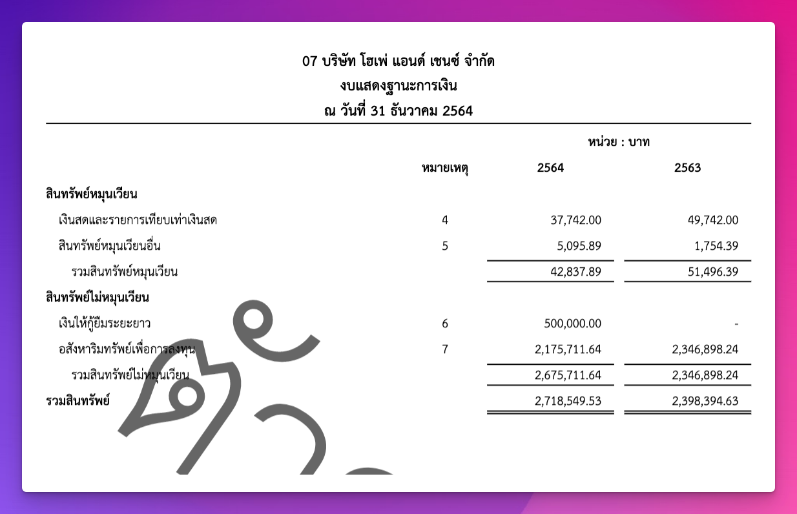

# Statement of Financial Position

`Adapter` ชุดแรกที่จะแนะนำให้รู้จักคือกลุ่มที่จะแสดงข้อมูลในหน้า "**งบแสดงฐานะทางการเงิน**", "**งบแสดงฐานะทางการเงิน(ต่อ)**" "**งบกำไรขาดทุน**" ซึ่งในหน้าเว็บก็จะเป็นตารางทั้ง 3 ตารางและ PDF 3 หน้า

## NewAssetBalanceSheetAdapter - งบแสดงฐานะทางการเงิน

งบแสดงฐานะทางการเงิน(ต่อ) จะเป็นหน้าที่สองมีการเอางบในหมวด **สินทรัพย์** มาแสดง โดย class `NewLiabilitiesAndEquityBalanceSheetAdapter` จะเป็นส่วนที่แปลง result จาก `StatementOfFinacialRowDataBuilder` ให้มาอยู่ใน format ของตารางที่พร้อมนำไปแสดงผลทั้งในหน้าตารางโดยใช้ function `renderTableRows()` และ `renderRows()` สำหรับหน้าพิมพ์ โดยที่ภายในแต่ละ function จะมีการเอา data มาจัดเรียงบรรทัดให้ได้ตาม format ที่นักบัญชีต้องการ หากต้องการแก้ไขสามารถเริ่มจาก 2 function นี้ได้เลย

ภาพตัวอย่างในหน้าพิมพ์


## NewLiabilitiesAndEquityBalanceSheetAdapter - งบแสดงฐานะทางการเงิน(ต่อ)

งบแสดงฐานะทางการเงินจะเป็นหน้าแรก ที่จะมีการเอางบในหมวด **หนี้สินและส่วนของผู้ถือหุ้น** มาแสดง โดย class `NewAssetBalanceSheetAdapter` จะเป็นส่วนที่แปลง result จาก `StatementOfFinacialRowDataBuilder` ให้มาอยู่ใน format ของตารางที่พร้อมนำไปแสดงผลทั้งในหน้าตารางโดยใช้ function `renderTableRows()` และ `renderRows()` สำหรับหน้าพิมพ์ โดยที่ภายในแต่ละ function จะมีการเอา data มาจัดเรียงบรรทัดให้ได้ตาม format ที่นักบัญชีต้องการ หากต้องการแก้ไขสามารถเริ่มจาก 2 function นี้ได้เลย 

> **📝 Note** 
> 
> แต่ในบางบรรทัดของหน้านี้จะไม่ได้มีความตรงไปตรงมาตามหมวดหมู่เหมือนหน้าแรก ทำให้มีการ hard code เอาไว้หลายจุด โดยเฉพาะส่วนของผู้ถือหุ้นที่จะมีการดึงมาจากทั้ง `TrialBalanceRecord` และ `AdditionalInfo`

ภาพตัวอย่างในหน้าพิมพ์


## NewIncomeAndExpenseBalanceSheetAdapter (งบกำไรขาดทุน)

งบแสดงกำไรขาดทุน ที่จะมีการเอางบในหมวด **รายได้่ และ ค่าใช้จ่าย** มาแสดง โดย class `NewIncomeAndExpenseBalanceSheetAdapter` จะเป็นส่วนที่แปลง result จาก `StatementOfFinacialRowDataBuilder` ให้มาอยู่ใน format ของตารางที่พร้อมนำไปแสดงผลทั้งในหน้าตารางโดยใช้ function `renderTableRows()` และ `renderRows()` สำหรับหน้าพิมพ์ โดยที่ภายในแต่ละ function จะมีการเอา data มาจัดเรียงบรรทัดให้ได้ตาม format ที่นักบัญชีต้องการ หากต้องการแก้ไขสามารถเริ่มจาก 2 function นี้ได้เลย 

> **📝 Note** 
> 
> แต่ในบางบรรทัดของหน้านี้จะไม่ได้มีความตรงไปตรงมาตามหมวดหมู่เหมือนหน้าแรก ทำให้มีการ hard code เอาไว้หลายจุด เช่นเดียวกับงบแสดงฐานะการเงิน(ต่อ)


## Data Type

Adater ทั้ง 3 ตัวจะ return data type ที่เหมือนกันทั้งหมด โดย function `renderRows()` จะ return `BalanceSheetTableRow[]` ซึ่งใช้กับหน้า PDF ซึ่งมี type ดังนี้

```ts
export enum BalanceSheetTableRowType {
	SectionHeader, // หัวข้่อหลัก 
	SubSectionHeader, // หมวดรอง
	Content, // เนื้อหาปกติใช้กับหมวดย่อย
	Summary, // สรุป หรือ ผลรวม
}

export type BalanceSheetTableRow = {
	order: number // ลำดับ (ปัจจุบันไม่ได้ใช้แล้ว)
	text: string // ข้อความที่แสดงเป็นตัวอีกษรใน row
	type: BalanceSheetTableRowType // ประเภท
	level?: 0 | 1 | 2 | 3 // ย่อหน้า
	remark?: string // หมายเลขของหมายเหตุ
	currentBalance?: number // ยอดปัจจุบัน
	previosBalance?: number // ยอดปีเปรียบเทียบ
	showUpperLine?: boolean // ขีดเส้นบน
	showBottomLine?: boolean // ขีดเส้นล่าง
	isRequiredToShow?: boolean // ต้องแสดงเมื่อไม่มีค่าหรือไม่
}
```

ในส่วนของหน้าตารางก็จะเรียกใช้ `renderTableRows()` ที่ return `SummaryTableRow[]` มี tpye ดังนี้

```ts
export enum SummaryTableRowType {
	Header,
	Content,
	Conclusion,
	Info,
}

export type SummaryTableRow = {
	order: number // ลำดับ (ปัจจุบันไม่ได้ใช้แล้ว)
	text: string // ข้อความที่แสดงเป็นตัวอีกษรใน row (รวมถึงหัวข้อด้วย)
	type: SummaryTableRowType // ประเภท
	workingPaper?: string // รหัสของ working paper (ยังไม่ implement ใน MVP)
	balance?: number // ยอดก่อนการปรับปรุง
	adjustingDebit?: number // ยอดปรับปรุงเดบิต
	adjustingCredit?: number // ยอดปรับปรุงเครดิต
	currentAdjustedBalance?: number // ยอดปัจจุบันหลังการปรับปรุง
	previousAdjustedBalance?: number // ยอดปีเปรียบเทียบหลังการปรับปรุง
	varience?: number // จำนวนความเคลื่อนไหวระหว่างปี
	variencePercentage?: number // จำนวนความเคลื่อนไหวระหว่างปีเป็นเปอร์เซ็นต์
}
```

ซึ่งหลังจากหน้า Web ได้ data ไปแล้วก็จะแปลงไปอยู่ใน format ของ pdfmake อีกทีเพื่อสร้าง PDF ไฟล์หรือเอาไป render เป็น HTML Table