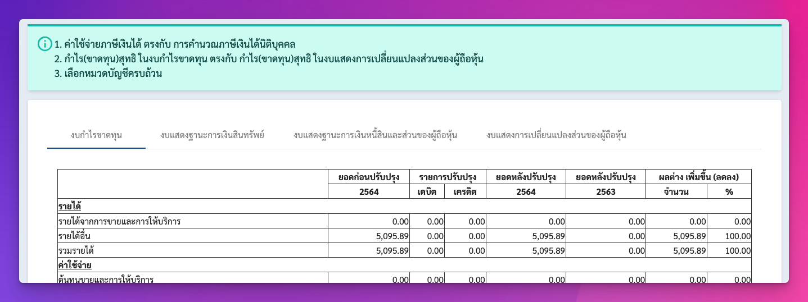

# Validator



เป็น class ในการตรวจสอบ `TrialBalance` หรืองบทดลองว่าถูกต้องเป็นไปตามกฎหรือไม่ โดยประกอบด้วย

1. `BalanceValidator` สำหรับตรวจสอบว่าผลรวมของ debit และ credit ในปีเดียวกันต้องเท่ากัน
2. `AccountCategoryValidator` สำหรับตรวจสอบว่าทุก record มีการเลือก account category ไว้แล้วหรือยัง
3. `ZeroBalanceValidator` สำหรับตรวจสอบว่ามี record ใดในงบที่มีเพียงค่า `0` จากทุก field หรือไม่
4. `NegativeValueValidator` สำหรับตรวจสอบว่ามี record ใดในงบที่มีค่าติดลบจากทุก field หรือไม่
5. `VarianceValidator` สำหรับตรวจสอบว่ามี record ที่มีการกำหนดค่า movement(variance) ผิดปกติหรือไม่ได้
6. `AssetDebtBalanceValidator` สำหรับตรวจสอบว่ามี record ที่มีการกำหนดค่า movement ผิดปกติหรือไม่ได้
7. `CorporateIncomeTaxValueValidator` สำหรับตรวจสอบว่า "ภาษีเงินได้นิติบุคคล" ในงบตรงกับค่าที่คำนวณได้หรือไม่
8. `NetProfitValidator` สำหรับตรวจสอบว่า "กำไรสุทธิ" ในงบตรงกับค่าที่คำนวณได้หรือไม่ (ซึ่งตอนนี้จะ return เป็นผ่านตลอดเพราะ sdk จะคำนวณตามสมการอยู่แล้ว แต่ที่ใส่ไว้เพื่อให้มี message ว่าผ่านในหน้างบทดลอง)

## How to use

สามารถดูตัวอย่างการใช้งานได้จาก `validator.test.ts`

```ts
const records = [
  new FABSTrialBalanceRecord({
    accountNumber: "1",
    title: "เงินสด",
    remark: "",
    currentDebit: 100,
    currentCredit: 0,
    varianceDebit: 0,
    varianceCredit: 0,
    previousDebit: 100,
    previousCredit: 0,
    accountCode: "111101",
  }),
  new FABSTrialBalanceRecord({
    accountNumber: "2",
    title: "เงินสด",
    remark: "",
    currentDebit: 200,
    currentCredit: 0,
    varianceDebit: 0,
    varianceCredit: 0,
    previousDebit: 200,
    previousCredit: 0,
    accountCode: "111101",
  }),
  new FABSTrialBalanceRecord({
    accountNumber: "3",
    title: "เงินสด",
    remark: "",
    currentDebit: 0,
    currentCredit: 300,
    varianceDebit: 0,
    varianceCredit: 0,
    previousDebit: 0,
    previousCredit: 300,
    accountCode: "111101",
  }),
];

const tb = TBMother(setOperationType(OperationType.ANNUAL))(
  starterTrialBalance()
);
tb.records = records;

const validator = new FABSValidator();
const result = validator.validate(records, [
  new BalanceValidator(tb),
  new AccountCategoryValidator(),
  new ZeroBalanceValidator(tb),
]);

t.is(result.errors.length, 0);
```

จากตัวอย่างไม่มี error ใดๆ ที่เกิดขึ้นแปลว่าผ่าน แต่หากไม่ผ่าน result จะมี error อยู่ใน `result.errors` และจะมี message อธิบายว่าผิดพลาดเนื่องจากอะไร เช่น

```ts
t.is(result.errors.length, 1);
t.is(result.errors[0].message, "พบรายการที่ยังไม่มีการเลือกหมวดบัญชี");
```
